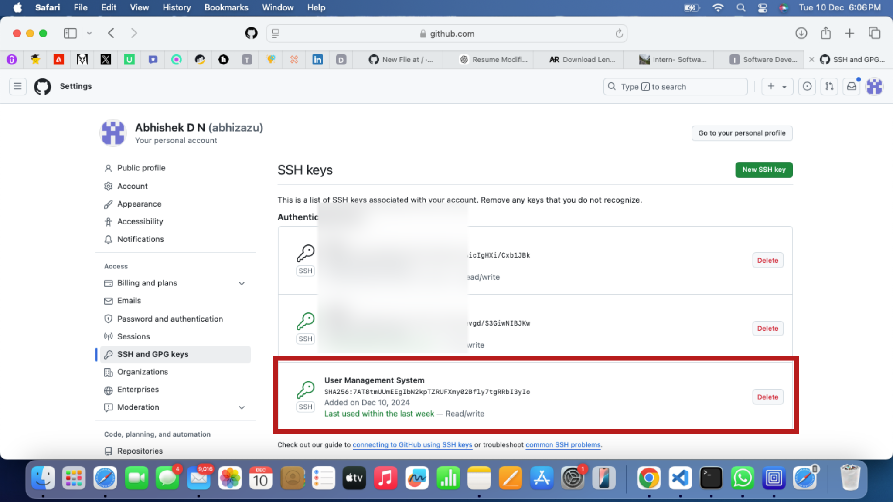
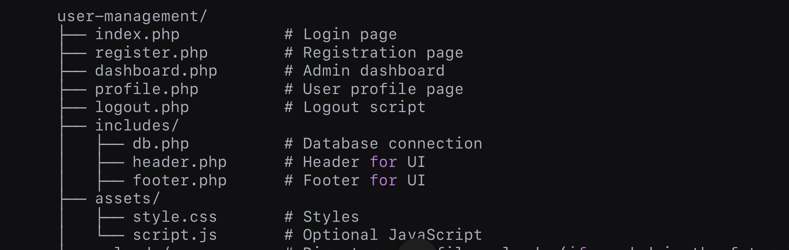

<h1>User Management System Web Application</h1>
Operating system: RED HAT LINUX ENTERPRISE(RHLE)
<OL>
  <li> SSH Connection Between Linux system and GitHub</li>
  
  

<li> File structure</li>
  
<li> login page --><a href="index.php">index.php</a></li>
<li> Dashboard page --><a href="dashboard.php">dashboard.php</a></li>
  <li>Profile page --><a href="profile.php">profile.php</a></li>
  <li>Logout page --><a href="logout.php">logout.php</a></li>
</OL>
